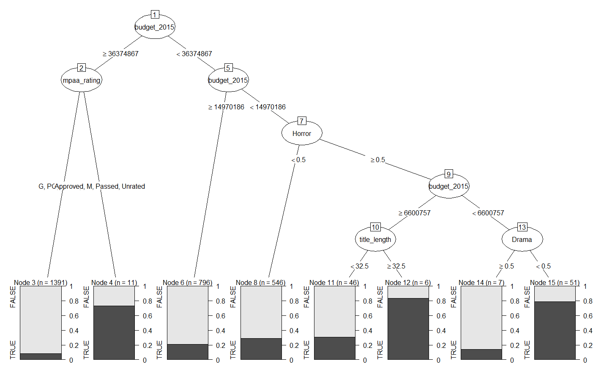

```{r,include=F,message=F}
knitr::opts_chunk$set(echo = F)
```

# Introduction
Is it possible to before its screening predict whether a movie will be a blockbuster, only based on publicly available information? This question can be of high relevance for movie producers or producing companies that face the issue of how to optimally plan a movies market rollout, as well as assess the prospects of their future outcome. For example if one can predict that a movie is likely to be a huge success one might try to push it in more countries than only in the local one and might even increase marketing budgets in order to gain the full potential out of the success. Another stakeholder that might be interested are movie theaters that might base their scheduling (room size, screening times etc.) on it.
We will analyze this question from a very neutral perspective, without even assessing the movie quality, but only the information that is publicly available before a movie start, which might also be the information that decision makers will base their decision on, especially if they are outside of the production itself (like movie theaters). 


# Data
```{r,include=FALSE,message=FALSE}
# TEST #
# Supervised Machine Learning - HW5 - #
# Maja Nordfeldt, Feb 2020 #

# -------------------------- Packages ---------------------------#

# rm(list = ls())
library(tidyverse)
library(partykit)
library(randomForest)
library("rpart")
library("rpart.plot")

# -------------------------- Data Preparation --------------------#

githubURL = "https://github.com/jakob-ra/Supervised-Machine-Learning/raw/master/HW5/imdb.RData"
load(url(githubURL))
#!!!! why / how set wd to git? to load data work

# Orig dataset
colnames(imdb)
sapply(imdb,class) # Checking classes of predictors


# Selecting relevant subset
df_imdb <- imdb[!is.na(imdb$budget_2015),] # drop missing budget
df_imdb <- df_imdb[!is.na(df_imdb$mpaa_rating),] # drop missing MPAA
df_imdb <- df_imdb[!is.na(df_imdb$gross_2015),] # Remove obs with missing values
df_imdb <- df_imdb[(df_imdb[,15]>=1000000),]# Select movies only budget at least 1m

# Make use of title: title length
df_imdb$title_length <- as.numeric(nchar(as.character(df_imdb$title)))
titles = df_imdb$title

# drop post screen variables
dropvars = c('imdb_score','gross', 'budget','user_reviews',
             'critic_reviews','director','actors','title','year')
dropind = colnames(df_imdb)%in%dropvars
df_imdb <- df_imdb[,!dropind] # dropping

# create factor out of genre dummies


# outcome
df_imdb$gross_x3 <- as.factor(df_imdb$gross_2015 >= (df_imdb$budget_2015)*3)
# 1 = movies gross box office takings of at least three times its budget 

# Plot budget vs revenue, line with slope 3
plot(df_imdb$budget_2015,df_imdb$gross_2015)
abline(a=0,b=3)

plot(log(df_imdb$budget_2015),log(df_imdb$gross_2015),
     ylab = 'log gross',xlab='log budget')
xgrid = seq(0.1,4e8,length.out = 1000)
lines(log(xgrid),log(3*xgrid),col='red',lwd=2)
legend('bottomright',legend = 'gross = 3*budget',col='red',lwd = 2)


```

In order to answer our proposed question of how to predict a movie success we are using a sample out of data published by the Internet Movie Database (IMDb) that is publicly available for download. IMDb is an online database, in which users can not only view information about movies and actors/actresses but can also rank the movies.
The available datasets comprises information on movie names, director and actors as well as on the used budget and the assigned genre of the movie. We define a movie as being successful if it manages to gain more than three times in box gross revenue than the available budget in the movie production. Box gross revenue is the income a movie gains from movie theater screenings. For both measures we are using inflation corrected numbers in 2015 dollars and define $gross_{x3}$ to be TRUE if the movie was successful according to our criterium.
We exclude the names of the participating actors due to the otherwise extensive number of categorical variables but use the number of Facebook likes of the main actors as a proxy for the popularity of the cast and do the same for the director of the movie. We exclude reviews from critics and IMDb users, since they are likely to only be available after the start of the movie. We nevertheless include the MPAA rating that gives a recommendation on the age of the targeted audience that should be allowed to watch it since one can expect that this might have an influence on the success of a movie. The rating system is giving recommendations from suggested for the general audience to only suggested for people above the age of 17. We drop the year variable since it should be without interest for decision makers since they can not influence the timing of the movie release or put differently it is without interest to know if movies were especially successful in a certain year. We additionally include 0 or 1 dummies for all genres, since movies can also fall into several of the categories. We also include the length of the title since one can assume that short titles might be catchier and therefore more successful. Finally we also include the movie budget but exclude all movies with a budget below one million dollar.
A first inspection of the data shows that their are missing values in some of the observations, which we will drop in our manual estimation. Another important feature of the data is its unbalanced ness. Looking at FIGURE XYZ in which we plot the movie budget versus the movie success one can see that there is a large amount of movies that do not make the threshold and only very few (about one fifth) that are categorized as successful. One can also see that there is only a few very expensive movies while most movies are in the bottom of the budget range.

```{r, out.width = "50%", fig.pos="h",fig.cap="Gross vs. Budget, logarithmed",fig.align='center'}
knitr::include_graphics('./datavisual.pdf')
```

### Leave gross_2015 saved as separate variable to get mean for table

```{r,echo=F, message=F, tab.lp="tab:1"}
library(pander) 
pander(c(' ' ='mean',
         Budget=round(mean(df_imdb$budget_2015)),Revenue=round(mean(df_imdb$gross_2015)),
         'Cast-FB-likes'=round(mean(df_imdb$cast_facebook_likes)),
         'Director-FB-likes'=round(mean(df_imdb$director_facebook_likes)),
         Duration=round(mean(df_imdb$duration))),
       caption = "Mean statistics of main variables")


df_imdb = subset(df_imdb, select = -gross_2015) # drop gross asa  predictor

# Missing values
# summary(is.na(df_imdb))
# 
# # Analyse data imbalance
# summary(df_imdb$gross_x3)
```


In table \ref(tab:1) one can see the mean of our main variables of interest, excluding the genre dummies. One can see that the average movie budget is 51 million 2015-US dollar, the average facebook likes of the cast are 12 thousand and the avergae duration is 110 minutes, so 20 minutes more than the standard 90 minutes movie framework.

# Methods
The predictive model we employ is a decision tree, which is found using a greedy, recursive, divide-and-conquer algorithm. The method is best explained using figure 1, a graph of a decision tree. For our binary classification problem, the decision tree will consist of a number of nodes (1,2,3,4,5,6,7). At each internal node (1,3,5), the data is split into two parts, creating two new branches. At the terminal nodes (also called leafs; here 2,4,6,7), we simply make our prediction as the majority class for all observations left at the leaf: FALSE at nodes 2,4, and 6; TRUE at node 7. 

We let the splitting function depend only on one variable and choose the splitting variable and the threshold value to minimize resulting node impurity, a function of the the share of mis-classified observations using the splitting rule. There are different measures for node impurity, the one we will be using in practice is the Gini impurity given by $G=1-p_0^2-p_1^2$, where $p_0$ and $p_1$ are the shares of class FALSE and TRUE, respectively. In practice, we start at node 1 with the full dataset, try each combination of splitting variable and threshold value (if numerical \footnote{If categorical, we try as splitting rules all combinations of categories.}) and choose the one that results in the lowest impurity. In this case, the best resulting splitting rule was to split movies according to whether their budget was higher or larger than 36 million USD. We then create two child nodes (2 and 3), at which we repeat the process of trying to find the best splitting rule.  

Following this algorithm, the tree would grow and become more specific until many leafs contain only one observation. This would be over-fitting, as the tree is not able to separate the noise from the signal, and such a tree would perform very poorly out of sample. For this reason, we need to specify a stopping rule for the tree. Popular stopping rules include setting a maximum depth (depth is the longest distance from the root to a leaf, here 3), or a minimum number of observations in a node for a split to be attempted. Another approach is to stop splitting when the resulting reduction in prediction errors drops below a threshold. The issue with this approach is that there might be splits which are not valuable in themselves, but that enable valuable splits further down the line. The danger is therefore that we stop splitting prematurely.  

This can be solved with a procedure known as pruning: we fist grow a large (overfitting) tree and then prune the large tree by removing subtrees (such as the one starting at node 5). Specifically, we have a pruning criterion function that is the sum of the  prediction error and a penalty $\alpha$ on the size of the tree (the size is the number of leafs, here 4). As $\alpha$ increases, we will remove more and more subtrees and end up with a lean tree with better out-of-sample performance. As $\alpha$ tends to infinity we end up classifying all observations as the majority class. The optimal $\alpha$ can be found via k-fold cross-validation: we randomly shuffle the data and divide it into $k$ bins. We then use the $k-1$ bins for training and the remaining bin for testing out-of-sample performance, iterating $k$ times to use each bin as a test sample once. The optimal $\alpha$ is the one that gives the lowest average out-of-sample prediction error.  

Another approach to get predictions from decision trees with good out-of-sample performance is to use an ensemble of trees. A set of training data leads to a unique optimal tree given the stopping criteria. However, we can generate different training sets from our existing data using by bootstrapping: if our original sample has $n$ observations, sampling $n$ times with replacement from the original sample leads to a new data set. We can create $B$ such new samples from $B$ bootstraps, which will lead to $B$ trees. Finally, we take the 'average' prediction of our tree ensemble (forest). In a binary classification setting, the prediction for a given observation will simply be that made by the majority of trees. This procedure is known as bagging (= bootstrap aggregating) and makes our prediction more robust (to the fact that our observations are noisy and we have a random sample). Unfortunately, we lose the easily interpretable nature of a single decision tree (as the one in figure 1) as we now have $B$ different trees. However, we can get a measure of which variables are important by looking at the total decrease in Gini impurities from splitting on the variable, averaged over all trees. Note that bagging still requires a stopping criterion for the trees to not grow too large; we will simply use a maximum depth.


# Results

## single tree

```{r,include=FALSE,message=FALSE}

# ------------------ Package results for reference --------------------#

# small tree for visual explanation

treesmall = rpart(gross_x3 ~ . - gross_x3 -mpaa_rating, 
                  control = rpart.control(minsplit =5, minbucket = 5,
                                          xval=5,cp = 0.004,maxdepth = 3), 
                  data=df_imdb, method="class")

plot(as.party(treesmall))


# Single tree - cp = 1e-7 to get nice cp plot
set.seed(1)
tree = rpart(gross_x3 ~ . - gross_x3, 
             control = rpart.control(minsplit =5, minbucket = 5,xval=10,cp = 1e-7,maxdepth = 10), 
             data=df_imdb, method="class")
plotcp(tree)# 	plot cross-validation results

cpprint = printcp(tree)
cvmin = cpprint[which.min(cpprint[,4]),1]
cat('best cp:',cvmin,'\n')
cat('min xerror =:',cpprint[which.min(cpprint[,4]),4],'\n')


# Single tree - cp = 0.006 --> cross validated parameter
set.seed(1)
tree = rpart(gross_x3 ~ . - gross_x3, 
             control = rpart.control(minsplit =5, minbucket = 5,xval=5,cp = cvmin,maxdepth = 10), 
             data=df_imdb, method="class")

pred = predict(tree, type="class")
tree.conf = table(df_imdb$gross_x3,pred)
tree.conf.error = c(tree.conf[1,2]/(tree.conf[1,1]+tree.conf[1,2]),
                    tree.conf[2,1]/(tree.conf[2,1]+tree.conf[2,2]))
tree.conf = cbind(tree.conf,tree.conf.error) # attach confusion error
colnames(tree.conf) = c('pred 0','pred 1' ,'class.error')
rownames(tree.conf) = c('obs 0','obs 1' )
```


```{r, fig.cap="Confusion Matrix"}
knitr::kable(tree.conf)
```


```{r, include=FALSE}
# plot the tree
plot(as.party(tree))
tree$splits
prp(tree)
```


```{r, fig.pos="h",fig.cap="Decision for optimal cp",fig.align='center'}

```


## bagging

```{r,eval=F}

set.seed(1)
bag = randomForest(gross_x3 ~ . - gross_x3, data = df_imdb, mtry = length(df_imdb)-1, ntree = 500)

# results
colnames(bag$confusion) = c('pred 0','pred 1' ,'class.error')
rownames(bag$confusion) = c('obs 0','obs 1' )
knitr::kable(bag$confusion)
par(mfrow=c(1,2))
varImpPlot(bag)
plot(bag,lwd=2,main = 'Classification error')
legend('right',legend = c('Class 0','Class 1','overall'),col=c('red','green','black'),lty= c(2,3,1))
```


|      | pred 0| pred 1| class.error|
|:-----|------:|------:|-----------:|
|obs 0 |   2256|     95|   0.0404083|
|obs 1 |    398|    105|   0.7912525|


```{r,fig.cap="Results bagging",fig.align='center'}
knitr::include_graphics('./bagplots.pdf')
```


# Conclusion & Discussion

In this study, we asked the question whether we could predict whether a produced movie would return three times its budget before the start of its screening. Using binary classification, as well as bagging we found that it is indeed possible. 

XXX discussion of results XXXX

From a perspective of practice implementation the classification tree is intuitive and easy to interpret, which may be a benefit if to be used for convincing stakeholders and making collective decisions in an organization. We can further clearly follow the steps behind the outcome, more transparent than the “black-box” results of some other methods. Data preparation needed is also sparse - variable standardization is not needed, missing values are treated robustly and dummies are not necessarily required for categorical variables. One also does not need to perform feature selection as it is done implicitly, and interactions and non-linearity is handled. On the downside, the results may not be robust - minor changes to training data can alter tree and final predictions, and overfitting can be a serious problem. The usefulness of predictions in practice can therefore come into question and results are sensitive to the quality of data. 

The bagged approach help reduce variance of the traditional classification tree, and out of bag estimates are easy to use for validation. Although we still have easily interpretable diagnostics like the Gini index, contrasting the classification tree we now lack the intuitive visual interpretation. We have not included an extremely large number of trees to spare computation, increasing it would however increase the likelihood of their errors to cancel out, although gains are likely small. Keeping all features for trees rather than randomly selecting some means we introduce more correlation between trees, and although we could obtain lower errors this way it may also lead to overfitting. 

For future research, one might want to repeat the exercise with measures to compensate for the unbalanced dataset, eg with a balanced bootstrapping algorithm. Further, one could try with more formally optimized parameters (e.g. number of trees in the bagging or number of levels in classification tree). The data is also possibly biased, likely only applying to the time and place of the observations, why the analysis could be redone with a another (more) representative training sample. 


# Code
```{r ref.label=knitr::all_labels(), echo = T, eval = F}
```